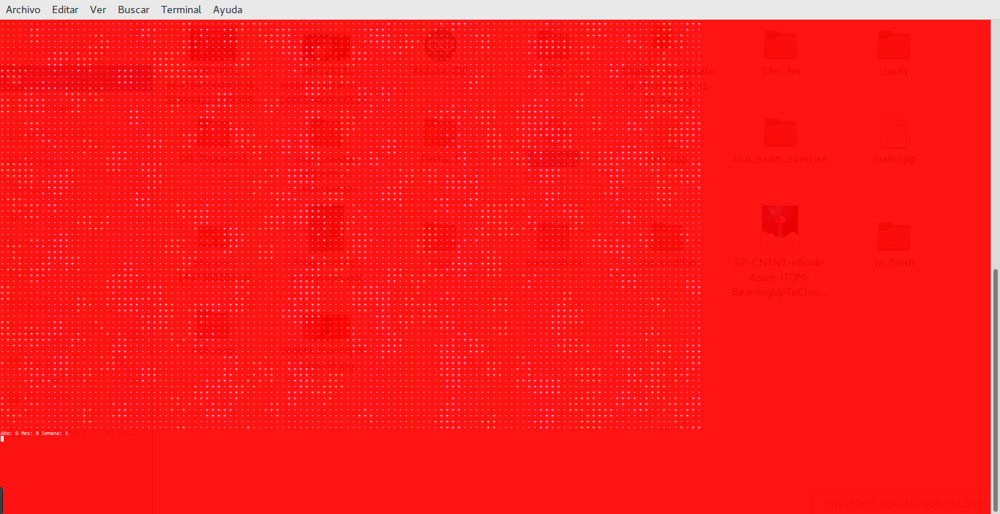
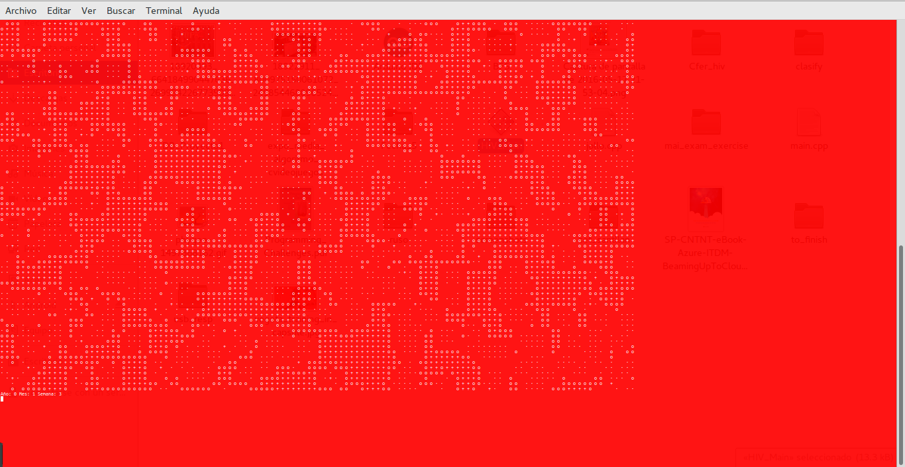
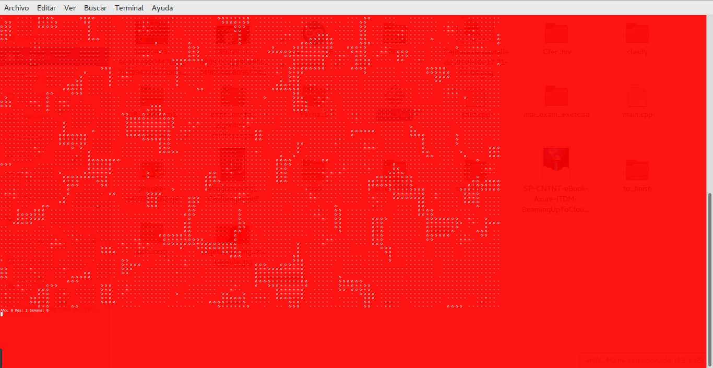
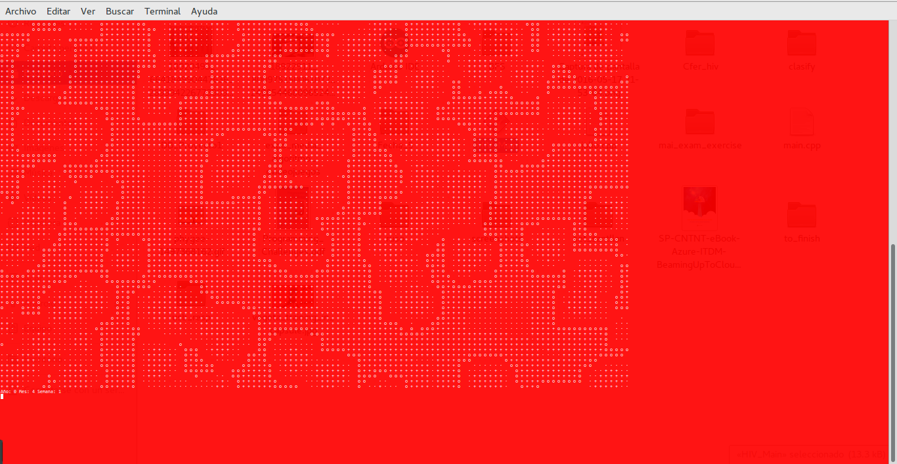
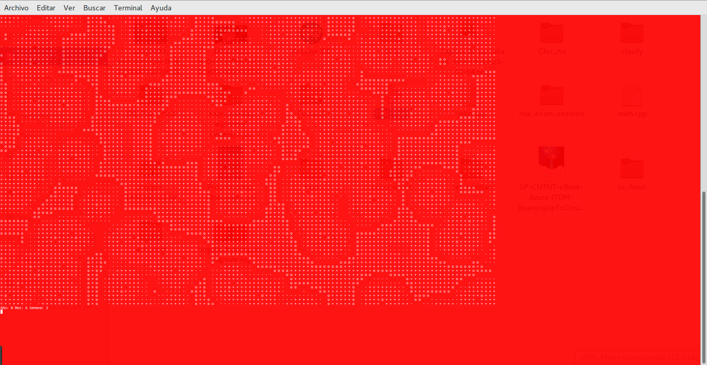
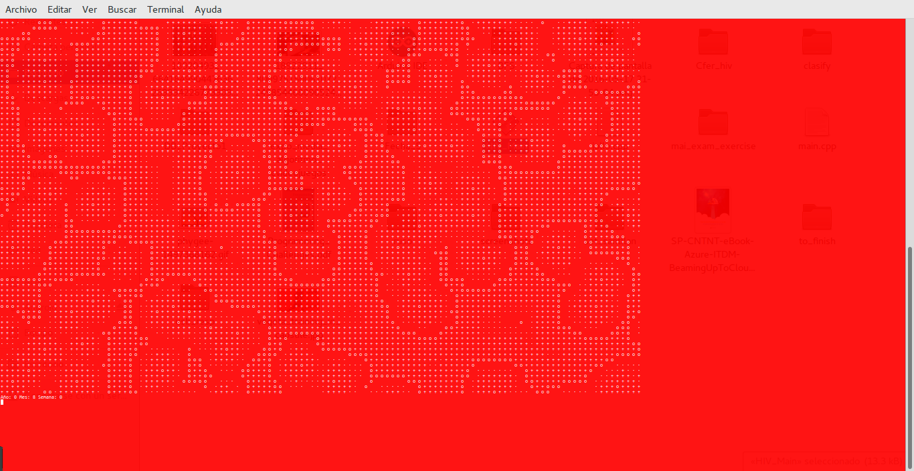

# VIH_Cellular_Automaton
A cellular automaton based on a model found on a document available at www.sciencedirect.com
The pdf is also available in this repository

I also added some screenshots to see the behavior of the automata

The entire project was made on ANSI-C because originally it was made to get an extra point for "algoritmia y programacion estructurada" which is a subject from my first semester at my university

## Animation
Here's a gif going at 200 milliseconds per image

## Screenshots

Here are some key images

